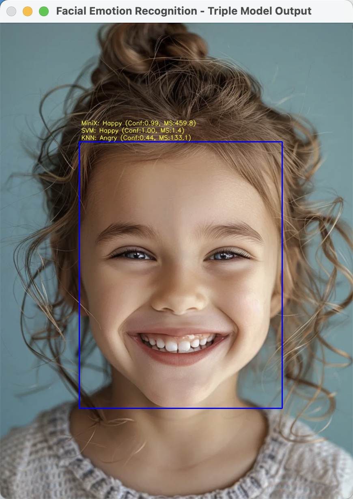
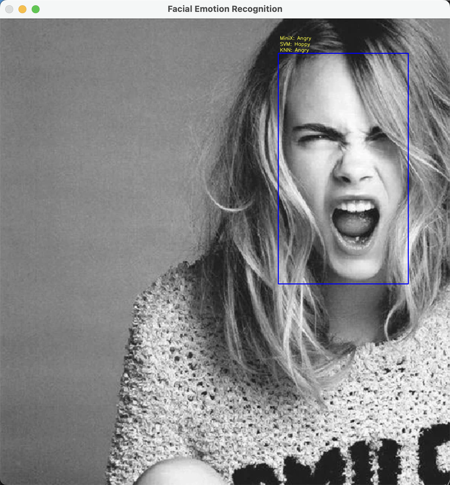
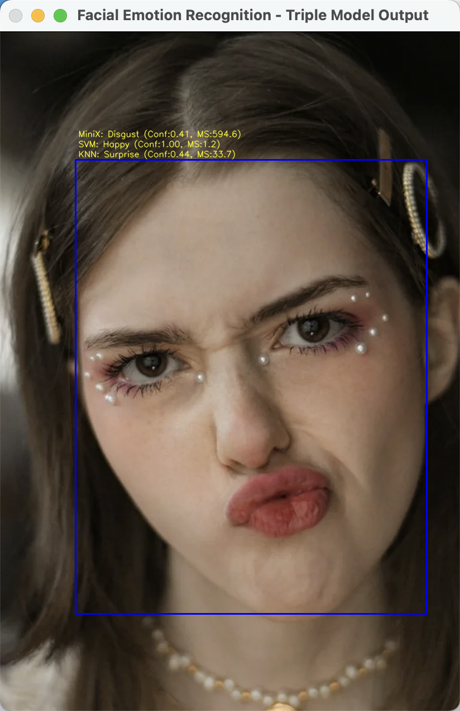
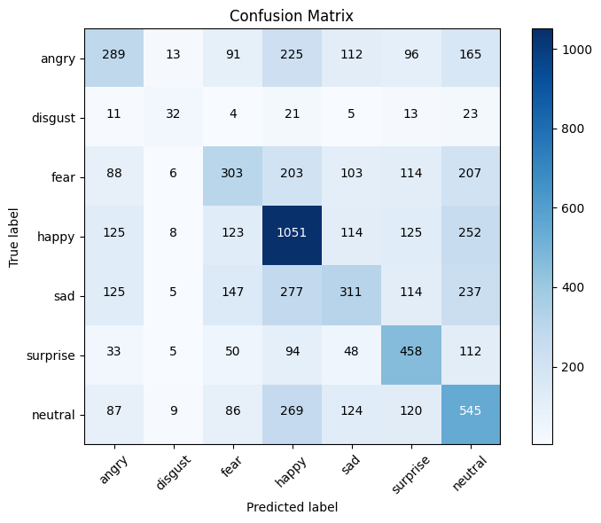
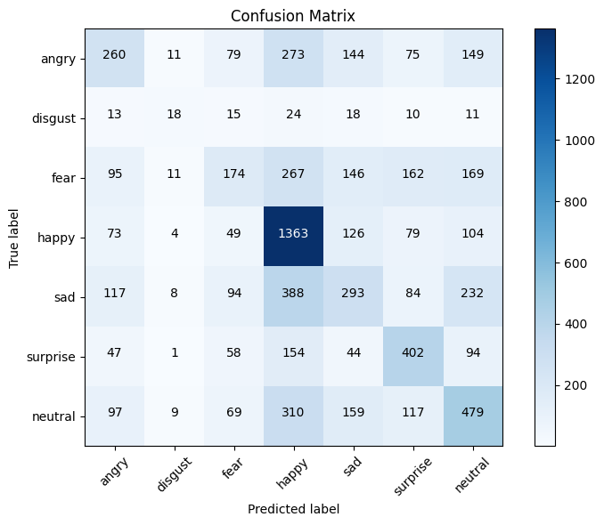
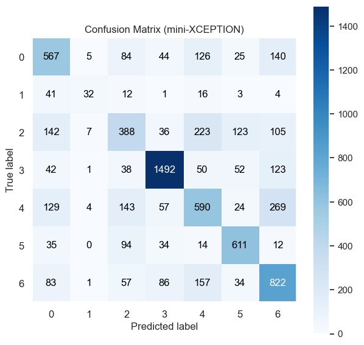

# Facial Emotion Recognition UI  
### **LBP+KNN | HOG+SVM | Mini-Xception (CNN)**  
Real-time and image-based facial emotion classification interface


##  Overview

This project implements a **complete interactive interface** capable of processing:

- Webcam video stream  
- Static images from user input  

For each detected face, the system runs **three different models** and displays:

- Predicted emotion  
- Confidence  
- Latency (ms)  
- Side-by-side visual comparison  

Face detection uses **OpenCV DNN (SSD ResNet-10 model)**.

---

##  Demo (Webcam Interface)

<p align="center">
  
</p>

---

##  Demo (Image Classification)

<p align="center">
  
  
  
  
</p>

---

#  Features  

###  Supports two modes
- **Webcam real-time mode**
  ```bash
  python Emotion_Classification.py
  ```
- **Image classification mode**
  ```bash
  python Emotion_Classification.py image.jpg
  ```

###  Three prediction models

| **Model**               | **Feature Extractor**      | **Classifier**            |
|------------------------|----------------------------|---------------------------|
| **LBP + KNN**          | LBP histogram              | KNN (GridSearchCV)        |
| **HOG + SVM (OvR)**    | HOG features               | LinearSVC                 |
| **Mini-Xception (CNN)** | Raw 48×48 grayscale        | CNN                       |

### GUI Features
Model switching via trackbar

## Model Details
###  LBP + KNN

- LBP extracted on 8×8 grids  
- Feature dimension: **640**  
- Tuned via:

```python
n_neighbors = [3,5,7,9]
weights = ['uniform', 'distance']
metric  = ['euclidean','manhattan','chebyshev']
```

###  HOG + Linear SVM
- HOG features extracted with:
	- orientations = 9
	- pixels_per_cell = 8×8
	- cells_per_block = 2×2
- Feature dimension: (depends on image, typically ~2304)
- Trained with:

```python
param_grid_svm = {
    'C': [0.1, 1, 10, 100]
}
svm = LinearSVC()
```

### Mini-Xception (CNN)
- Input: 48×48 grayscale
- Architecture (summary):
```
Conv → BN → ReLU → DWConv → BN → ReLU  
↳ repeated residual blocks  
Global Average Pooling  
Dense → Softmax (7 classes)
```
- Training:
	- Dataset: FER-2013
	- Test Accuracy: ~60–67%
	- Optimizer: Adam
	- Loss: categorical crossentropy

### Dataset
The data consists of **48x48 pixel grayscale** images of faces. and their emotion shown in the facial expression in to one of seven categories (Angry, Disgust, Fear, Happy, Sad, Surprise, Neutral), The training set consists of **28,709 examples**. The public test set consists of **3,589 examples**.

[Download FER2013](https://www.kaggle.com/deadskull7/fer2013)
- create a folder called "data/" in project root
- put the "fer2013.csv" in it

## Latency & Validate Output

| **Model**               | **Validate-Accuracy**      | **Latency**               |
|-------------------------|----------------------------|---------------------------|
| **LBP + KNN**           | 0.41                       | 0.7979ms                  |
| **HOG + SVM (OvR)**     | 0.42                       | 0.0101                    |
| **Mini-Xception (CNN)** | 0.63                       | 0.2276                    |

## Confusion Matrix

| KNN (LBP Features) | SVM (HOG Features) | Mini-Xception (CNN) |
|--------------------|--------------------|---------------------|
|  |  |  |

</div>
